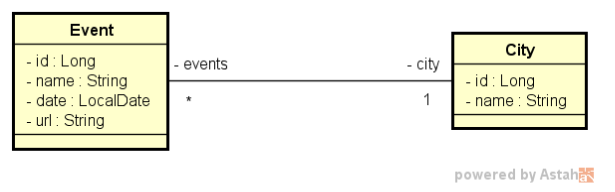

# Desafio TDD
---

#### Implemente as funcionalidades necessárias para que os tes

Este é um sistema de eventos e cidades com uma relação N-1 entre eles:

---
### Testes:

**CityControllerIT**

- findAllShouldReturnAllResourcesSortedByName
- insertShouldInsertResource
- deleteShouldReturnNoContentWhenIndependentId
- deleteShouldReturnNotFoundWhenNonExistingId
- deleteShouldReturnBadRequestWhenDependentId

**EventControllerIT**

- updateShouldUpdateResourceWhenIdExists
- updateShouldReturnNotFoundWhenIdDoesNotExist

---
`Collection do Postman:
https://www.getpostman.com/collections/c347ea3428d6b199b391`
